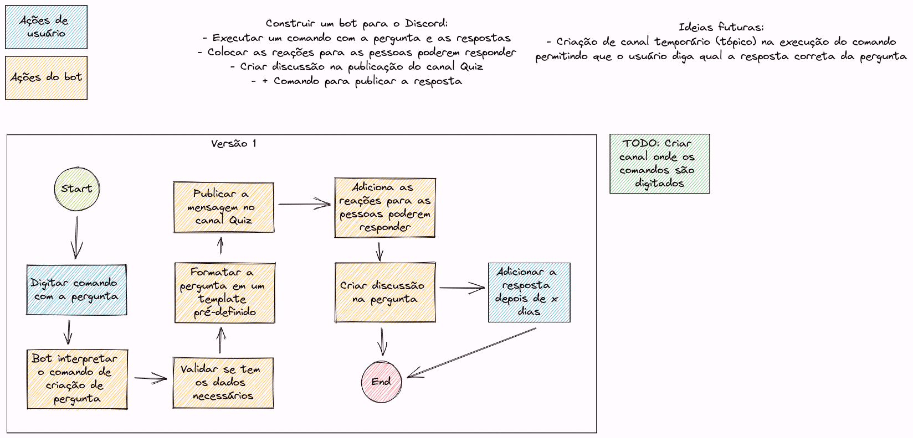

# Bot Perguntas

Bot para criação de perguntas no Discord da comunidade para interações.
O desenvolvimento e a criação do bot está sendo feito em lives no canal
[Universidade Livre](https://twitch.tv/universidade_livre).

O que o bot precisará fazer:
- Criar perguntas no canal Quiz
- Adicionar reações a pergunta criada
- Criar tópico para discussão na pergunta

# Projeto

O que foi feito até agora:
- Criação do fluxo da V1 de como o bot deverá funcionar

O que precisa ser feito:
- Criação do bot
- Implementação de um comando para dizer a resposta correta da pergunta
- Implementação para usuários não admins/mods criarem perguntas

## Fluxo da V1

