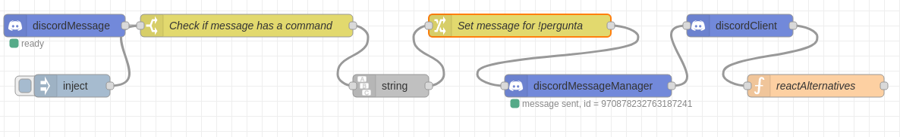
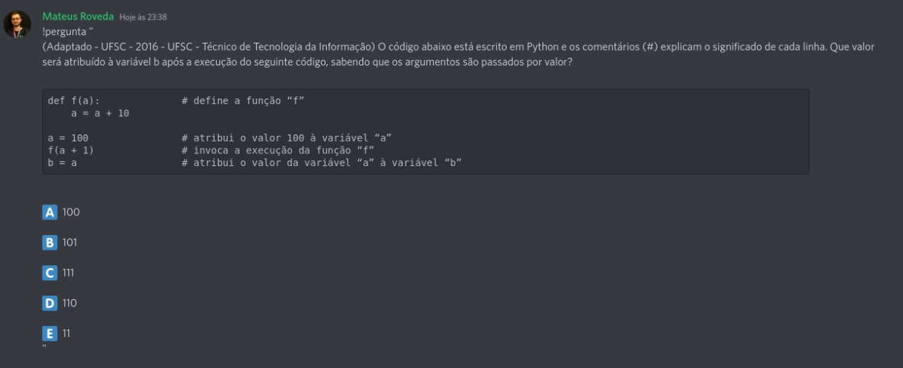
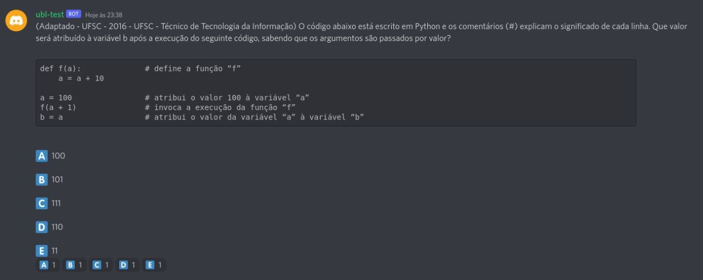

# Bot Perguntas

Bot para criação de perguntas no Discord da comunidade para interações.
O desenvolvimento e a criação do bot está sendo feito em lives no canal
[Universidade Livre](https://twitch.tv/universidade_livre).

O que o bot precisará fazer:
- Criar perguntas no canal Quiz
- Adicionar reações a pergunta criada
- Criar tópico para discussão na pergunta

# Executando localmente
Para exercutar o projeto localmente você precisa ter o docker e docker-compose 
instalado.

Clonar o projeto
```
git clone https://github.com/Universidade-Livre/bot-perguntas.git
```

Fazer o build da imagem
```
docker compose build

OU

docker-compose build
```

Executar o projeto
```
docker compose up -d

OU

docker-compose up -d
```

Acessar a URL: http://localhost:1880

# Projeto

O que foi feito até agora:
- Criação do fluxo da V1 de como o bot deverá funcionar
- Criação do ambiente para execução do Node-RED

O que precisa ser feito:
- Criação do bot
- Implementação de um comando para dizer a resposta correta da pergunta
- Implementação para usuários não admins/mods criarem perguntas

Ideias futuras:
- Consumir perguntas de um CSV
## Fluxo da V1
Planejado


Node-RED


## Tecnologias

(ainda precisam ser testadas, são apenas anotações)

- [Node-RED](https://nodered.org/)
- [Node Discord Advanced](https://flows.nodered.org/node/node-red-contrib-discord-advanced)
- [Discord API](https://discord.com/developers/docs/intro)
- [Discord API - Create reaction](https://discord.com/developers/docs/resources/channel#create-reaction)

## Resultados

Comando para criação da pergunta



Publicação do bot

